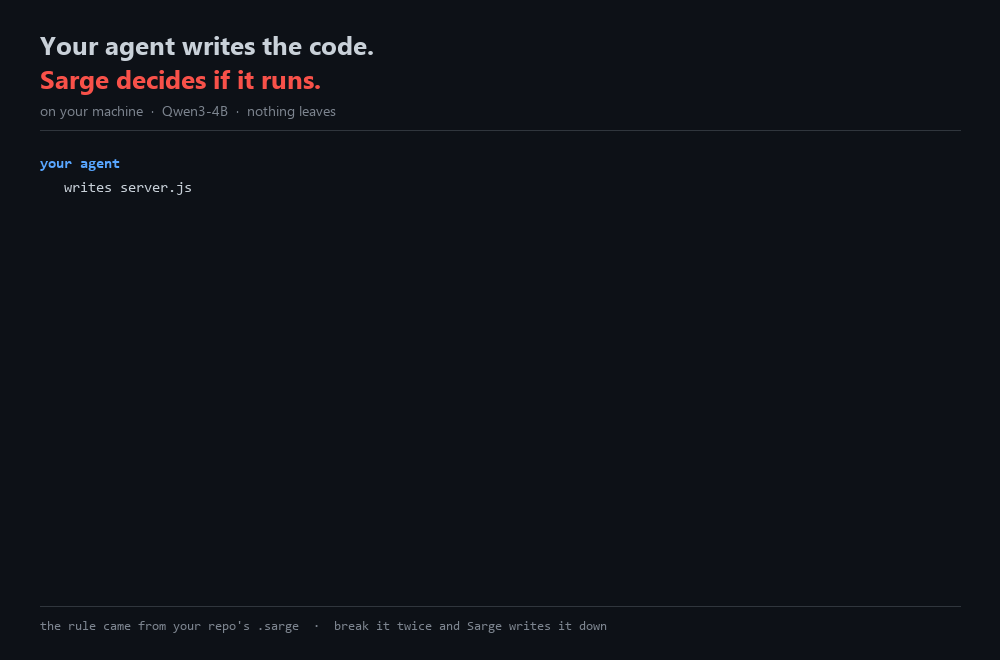

# Sarge

**Your agent writes the code. Sarge decides if it runs.**

Every file your coding agent writes gets checked against your repo's rules — by a small
model on your own machine (Qwen3-4B, 2.3 GB). Break a rule and the code doesn't run until
it's fixed. Break the same rule twice and Sarge writes it down, so next time it's already
there.



## What actually happens

**Your agent writes a bad file.** Sarge catches it and tells the agent what's wrong. The
agent fixes it. You didn't have to say anything.

**The agent tries to run the app anyway.** It can't. Nothing runs while a rule is broken —
that's the whole point.

**The file gets fixed.** Sarge steps out of the way and the app runs.

**Sarge can't check for some reason?** It says so, loudly, every single time. It will never
quietly tell you everything's fine when it hasn't looked.


## How this is different

| | AI coding agents | Sarge |
|---|---|---|
| where the rules live | in the prompt | in your repo, checked after the file is written |
| what happens if a rule is broken | nothing | the code doesn't run |
| who reads the rules | the same model writing the code | a second model, on your machine |
| do the rules improve | only when you edit them | Sarge writes new ones from what broke |
| where your code goes | to their servers | nowhere |

## Install

**macOS**, Apple silicon:

```bash
curl -fsSL https://raw.githubusercontent.com/1picassoai/Sarge/main/install.sh | bash
```

**Linux**, 64-bit:

```bash
curl -fsSL https://raw.githubusercontent.com/1picassoai/Sarge/main/install-linux.sh | bash
```

It clones this repo, downloads the engine for your machine, and fetches the model. Then
start it and leave it running:

```bash
./start-organ.sh
```

**Switch it on for a repo.** Copy `hooks/settings.example.json` into
`.claude/settings.json`, and put a `.sarge` file at the repo root — copy
`book/universal.sarge` if you haven't got one. That's it.

**Already running a local model?** Point Sarge at it instead — set `SARGE_ORGAN` to its
address and skip the 2.3 GB download. Qwen3-4B is what we test on and what we'd recommend,
but nothing here is tied to it.

That address has to be on your own machine. If it isn't, Sarge says so and uses the local
one anyway — your code doesn't leave by accident because of a pasted URL.

*Windows works too: `irm https://raw.githubusercontent.com/1picassoai/Sarge/main/install.ps1 | iex`
in PowerShell.*

## The rules

Sarge comes with **33 rules for Node and Express**, plus 3 that apply to any language. Each
one is written as real code — a wrong line and a right line — so the model can see the
difference rather than read about it:

```
rule config-not-code
  do     read the database name from configuration
  never  write a filename or connection string into source
  wrong  | const db = new DatabaseSync('tools.db');
  right  | const db = new DatabaseSync(config.database);
```

Your own rules go in `.sarge` at your repo root. Yours always win.

## The numbers

| | |
|---|---|
| what you need | 8 GB RAM, 4 cores. A GPU makes it quicker; it isn't required |
| download | 2.3 GB, almost all of it the model |
| checking one file | a few seconds on a GPU, about a minute on 4 cores |
| rules it ships with | 33 for Node, 3 universal |
| what leaves your machine | nothing. The check only talks to a model on your own machine — it refuses any other address unless you explicitly allow it. The tutor is the one exception, and only if you give it a key |

MIT. Something it got wrong? [Discussions](../../discussions).
