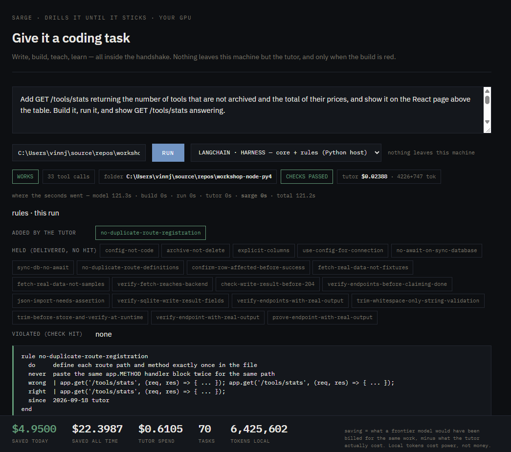
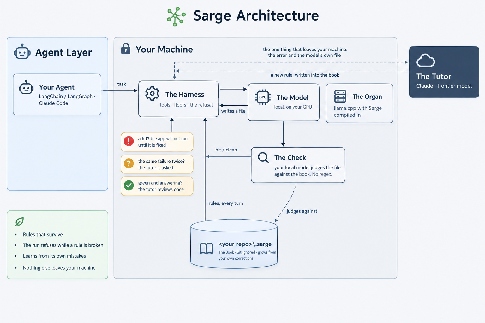

# Sarge

**Prompts negotiate. Sarge doesn't.**

> **Stop babysitting your coding agent.** Sarge checks every file it writes against your
> repository's rules and refuses to run the code until it complies. When the agent breaks the
> same rule twice, Sarge teaches it the fix — permanently.



## Why I built this

I wrote the rules of my codebase down for my coding agent. It read them, agreed with them,
and then shipped code that broke them anyway. Sometimes it did not even compile. So I
reviewed everything it wrote, every time, paying twice: once in tokens for code I could not
trust, and once in my own hours to find out why. The rules file was not the problem. Nothing
made the agent *keep* a rule after it had read it.

## What it does

A small model runs on your own machine and writes the code. Every file it writes is judged
against a rule book that lives in your repo — not by a regex, by the model itself — and
**the run refuses while a rule is broken.** When it gets the same thing wrong twice, a tutor
teaches it that rule once, from its own mistake, and writes it into the book. Next time, the
rule is already there, and it holds.

**Seven tasks on one repo, seven of seven correct.** The same model without Sarge: none.
**And the check itself: six of seven known faults caught, with one false flag** — it is your
local model judging a line, so it is only as good as that model. Every failure on the way is
written down with its cause, most of them ours.



Works with **LangChain / LangGraph** and as a **Claude Code hook**. The tutor is the one
thing that leaves your machine, and only if you give it a key.

## Get started

One command.

**Windows x64**, in PowerShell:

```powershell
irm https://raw.githubusercontent.com/1picassoai/Sarge/main/install.ps1 | iex
```

**macOS on Apple silicon**, in a terminal:

```bash
curl -fsSL https://raw.githubusercontent.com/1picassoai/Sarge/main/install.sh | bash
```

*macOS support is new. It is built and tested on Apple silicon by CI, which has no GPU —
so the install and the check are proven there, and Metal has never been exercised. No Mac
speed figures are published for that reason. If it misbehaves on your machine, say so in
[Discussions](../../discussions) and it gets fixed.*

**What it does, and nothing else:** clones the `v0.2.0` tag into a `Sarge` folder, downloads
the prebuilt organ for your platform and the model (2.4 GB) from Hugging Face, `pip install`s
the Python harness into that clone, writes two start scripts with your own paths in them,
then starts the organ and **proves the check can catch a known-bad file before it tells you
it is done.** Nothing is installed system-wide.

On Windows the CUDA runtime (405 MB) is fetched only if you have an NVIDIA card and no
toolkit already. No card, no download, and Sarge runs on the CPU. On Apple silicon Metal
ships with the OS and nothing extra is downloaded.

Then: `start-organ`, `start-console`, and open `http://127.0.0.1:8420`.
(`.cmd` on Windows, `.sh` on macOS.)

Prefer to do it by hand? **[The long way, every command explained →](../../wiki/Set-up-with-LangChain)**

## What you need

**8 GB RAM and 4 CPU cores.** A GPU makes it faster; it is not required.

Measured on Qwen3-4B (Q4_K_M), the model Sarge runs with, on a quiet Windows machine with
an 8 GB NVIDIA card. No Mac figures yet:

| | 4 cores, no GPU | 8 GB GPU |
|---|---|---|
| writing code | 11.4 tok/s | 72 tok/s |
| checking one 2,250-token file | ~70 s | a few seconds |

**It runs on a plain laptop, and it is comfortable on a card.**

MIT. Bring what your coding agent keeps getting wrong: [Discussions](../../discussions).
