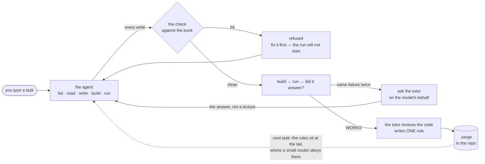
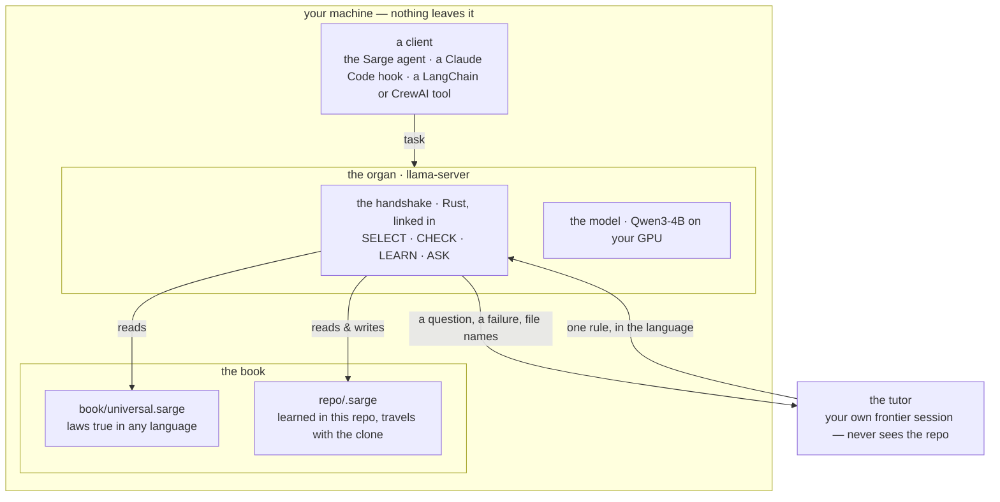

# Sarge — the flow

*Two diagrams, in Mermaid, so GitHub renders them in the README with no image file.
Paste the fenced blocks as they are.*

## The loop — one task, start to finish



**Read it left to right.** You give one task. The agent writes and builds and runs. Every
file it writes is checked against the book the moment it lands; a hit comes back as the
tool result and the app will not run until it is fixed. When the same failure comes back
twice, the loop asks the tutor for the model and hands it the answer. When the task ends
green, the tutor writes what it learned as one rule — with the wrong line and the right
line as code — into `.sarge` in the repo. The next task starts with it.

## Where things live



**The engine is the organ and the book.** Everything else is a client. Today the client
is the Sarge agent; the same engine sits behind a Claude Code hook on the write, and
behind the router when a subscription runs out and the model goes local — *when your
subscription runs out, your rules don't.*

## The rule, as the model reads it

```
=== sarge ===

rule use-config-for-connection
  do     read database filenames and connection strings from configuration or the environment
  never  hardcode database filenames or connection strings in source code
  wrong  | const db = new DatabaseSync(path.join(__dirname, 'tools.db'));
  right  | const db = new DatabaseSync(path.join(__dirname, config.database));
  since  2026-09-16 tutor
end

=== end sarge ===
```

Nine words. `do` first. Real code after the bar. Written by the tutor, never by a person —
though a person can, in the same nine words. This one was learned on 16 Sep 2026 from the
first task on a Node repo, and the second task got it at the tail.
